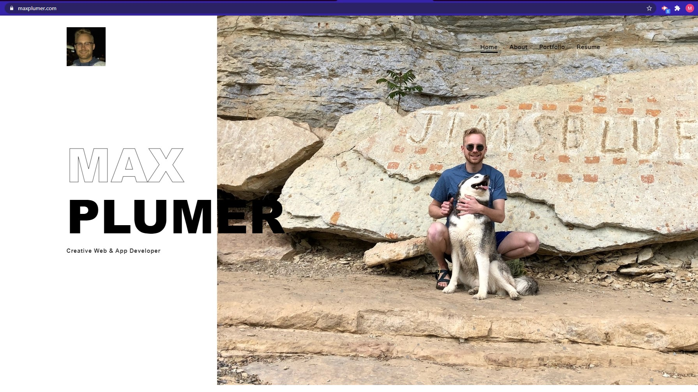
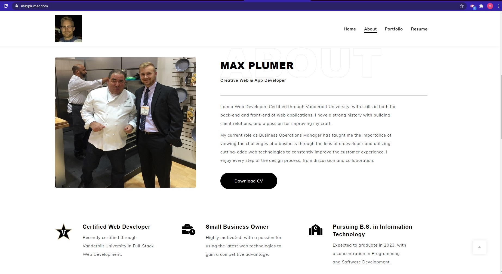
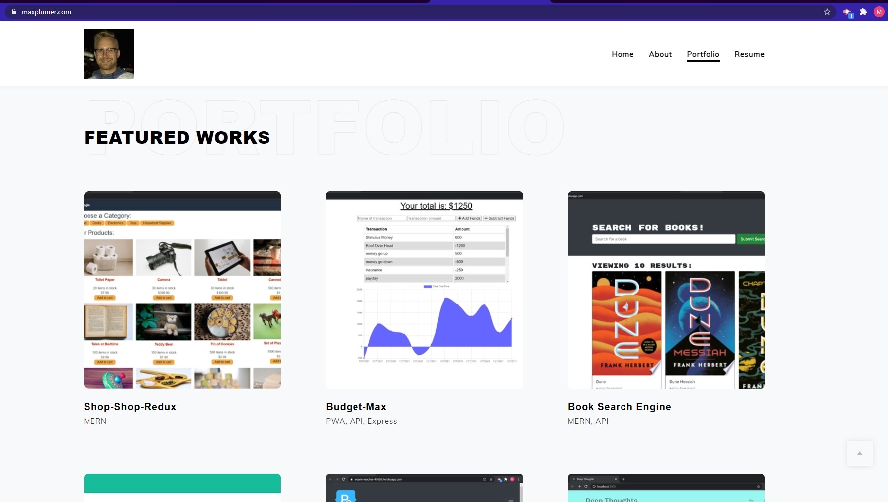

# AWS-Portfolio

## Description 
My latest portfolio, showcasing skills learned post bootcamp graduation. Created with Gatsby and React, hosted on an AWS S3 bucket using Cloudfront with Lambda redirects.

## Table of Contents
* [Installation](#installation) 
* [Usage](#usage) 
* [Contributing](#contributing)
* [Questions](#questions)

## Link to Deployed Application
* [Maxwell Plumer's Portfolio](https://www.maxplumer.com)

### Installation
Follow the deployed application link: https://www.maxplumer.com. From here, use the app online, and/or click the circled plus symbol in the url bar to install the PWA to your device for use offline.

### Usage
Use this portfolio to view my previous works, download a copy of my resume, get in contact wth me and schedule an interview! 

##### Interested in other projects from this developer? Visit the following GitHub page:
https://github.com/mplumer
    
##### Send any questions to the following email address:
maxplumer12@gmail.com
